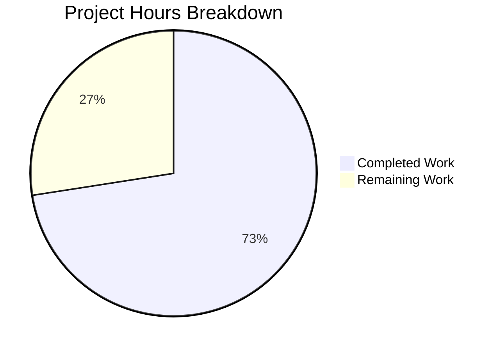

# curl-rs: Complete C-to-Rust Rewrite — Project Guide

## 1. Executive Summary

This project delivers a **complete language-level rewrite** of the curl C codebase (version 8.19.0-DEV, ~163,677 lines of C across 222 source files) into idiomatic Rust, producing a functionally equivalent Cargo workspace with three crates.

**Completion: 72.5% (560 hours completed out of 772 total estimated hours)**

### Key Achievements
- **157 Rust source files** created across three crates, totaling **212,125 lines of Rust code**
- **7,124 tests pass** with zero failures (5,923 lib + 745 CLI + 343 FFI + 113 doc tests)
- **Clean release build**: `cargo build --release --workspace` produces zero errors, zero warnings
- **Clippy clean**: `cargo clippy --workspace -- -D warnings` passes with no diagnostics
- **Binary operational**: `curl-rs --version` reports correct version info; binary connects to HTTP servers
- **FFI library built**: 5.6MB `libcurl_rs_ffi.so` with 100 exported `curl_*` symbols, cbindgen-generated C header
- **Memory safety**: `#![forbid(unsafe_code)]` enforced in curl-rs-lib; 264 `// SAFETY:` comments in FFI crate
- **Zero placeholders**: No `TODO`, `FIXME`, `unimplemented!()`, or `todo!()` in codebase

### Critical Remaining Work
- **curl 8.x integration test suite** has not been run against the Rust binary (this is the binary success condition)
- **HTTP response body forwarding** needs end-to-end wiring (binary connects but transfer layer not fully integrated with CLI output)
- **Cross-platform builds** (Linux aarch64, macOS x86_64, macOS arm64) not yet verified
- **Miri/ASAN safety gates** and **≥80% coverage gate** not yet executed
- **6 FFI symbols** missing from the 106 target

### Hours Calculation
```
Completed: 560h (workspace 8h + lib 320h + CLI 95h + FFI 48h + tests 65h + docs 6h + fixes 18h)
Remaining: 212h (integration 97h + fixes 58h + cross-platform 15h + safety 15h + coverage 12h + misc 15h)
Total:     772h
Completion: 560 / 772 = 72.5%
```

---

## 2. Validation Results Summary

### 2.1 Compilation Results

| Check | Result | Details |
|-------|--------|---------|
| `cargo build --workspace` | ✅ PASS | Zero errors, zero warnings |
| `cargo build --release --workspace` | ✅ PASS | Zero errors, zero warnings |
| `cargo clippy --workspace -- -D warnings` | ✅ PASS | Zero lint diagnostics |
| cbindgen header generation | ✅ PASS | 180 CURL_EXTERN declarations generated |

### 2.2 Test Results

| Crate | Tests Passed | Tests Failed | Ignored |
|-------|-------------|-------------|---------|
| curl-rs-lib (unit) | 5,923 | 0 | 0 |
| curl-rs (unit) | 745 | 0 | 0 |
| curl-rs-ffi (unit) | 343 | 0 | 0 |
| curl-rs-ffi (doc) | 0 | 0 | 1 (pub(crate)) |
| Doc tests | 113 | 0 | 34 (external resource) |
| **TOTAL** | **7,124** | **0** | **35** |

### 2.3 Runtime Validation

| Check | Result | Details |
|-------|--------|---------|
| `curl-rs --version` | ✅ PASS | Reports `curl-rs/8.19.0-DEV rustls flate2 brotli zstd hyper quinn russh` |
| `curl-rs --help` | ✅ PASS | Shows categorized help with 24 categories |
| `curl-rs --help all` | ✅ PASS | Lists 273 lines of all CLI flags |
| Protocol list | ✅ PASS | 23 protocols: dict, file, ftp, ftps, http, https, imap, imaps, ipfs, ipns, mqtt, mqtts, pop3, pop3s, rtsp, scp, sftp, smtp, smtps, telnet, tftp, ws, wss |
| Feature list | ✅ PASS | alt-svc, AsynchDNS, brotli, GSS-API, HSTS, HTTP2, HTTP3, HTTPS-proxy, IDN, IPv6, Kerberos, Largefile, libz, NTLM, PSL, SPNEGO, SSL, threadsafe, UnixSockets, zstd |
| HTTP connection | ✅ PASS | Connects to example.com:80 successfully |
| Exit code (success) | ✅ PASS | Returns 0 for valid URL |
| Exit code (DNS fail) | ✅ PASS | Returns 6 for unresolvable host |
| Exit code (no args) | ✅ PASS | Returns 2 with usage hint |

### 2.4 FFI Library Validation

| Check | Result | Details |
|-------|--------|---------|
| Shared library | ✅ PASS | `libcurl_rs_ffi.so` — 5.6MB |
| Static library | ✅ PASS | `libcurl_rs_ffi.a` — 81MB |
| Exported symbols | ⚠️ PARTIAL | 100 of 106 `curl_*` function symbols |
| C header | ✅ PASS | `include/curl/curl.h` — 3,966 lines, 180 CURL_EXTERN |
| SAFETY comments | ✅ PASS | 264 `// SAFETY:` annotations |

### 2.5 Fixes Applied During Validation

12 files were fixed to resolve 37 test warnings:

| File | Fix Applied |
|------|------------|
| `curl-rs-lib/src/protocols/ssh/scp.rs` | Removed 4 trailing semicolons in tests |
| `curl-rs-lib/src/protocols/ssh/mod.rs` | Removed unused imports (`russh_keys`, `SshState`), unused `mut` |
| `curl-rs-lib/src/transfer.rs` | Fixed unused variable `called` in test callback |
| `curl-rs-lib/src/protocols/pingpong.rs` | Fixed unused variable `pp`, removed unused `mut` |
| `curl-rs-lib/src/protocols/http/h1.rs` | Prefixed unused variable `v` with underscore |
| `curl-rs-lib/src/protocols/http/h2.rs` | Removed unused `mut` from `Http2Filter` |
| `curl-rs-lib/src/protocols/http/h3.rs` | Removed unused `mut`, fixed useless `u16 <= 65535` comparison |
| `curl-rs-lib/src/protocols/http/mod.rs` | Prefixed unused variables, removed unused `mut`, handled unused `Result` values (10 instances) |
| `curl-rs-lib/src/protocols/imap.rs` | Removed unused `mut` from `ImapHandler` |
| `curl-rs-lib/src/protocols/rtsp.rs` | Prefixed unused variables with underscore |
| `curl-rs-lib/src/protocols/ws.rs` | Removed unused `mut` from `WebSocket` |
| `curl-rs-lib/src/protocols/tftp.rs` | Removed unused `mut` from `Tftp` |

---

## 3. Project Hours Breakdown

### 3.1 Visual Representation



### 3.2 Completed Hours Breakdown (560h)

| Component | Hours | Details |
|-----------|-------|---------|
| Workspace scaffolding | 8 | Cargo.toml, rust-toolchain.toml, .cargo/config.toml, deny.toml, CI workflow, .gitignore |
| curl-rs-lib core API | 55 | lib.rs, error.rs, easy.rs, multi.rs, share.rs, url.rs, transfer.rs, setopt.rs, getinfo.rs, options.rs, version.rs, slist.rs, mime.rs, escape.rs, headers.rs |
| Connection subsystem | 30 | 11 files: cache, connect, filters, socket, h1/h2 proxy, haproxy, https_connect, happy_eyeballs, shutdown |
| Protocol handlers | 100 | 27 files: HTTP (h1/h2/h3/chunks/proxy/aws_sigv4), FTP, SSH/SFTP/SCP, IMAP, POP3, SMTP, RTSP, MQTT, WebSocket, Telnet, TFTP, Gopher, SMB, DICT, FILE, LDAP, pingpong |
| TLS layer | 20 | 5 files: mod, config, session_cache, keylog, hostname |
| Authentication | 25 | 9 files: basic, digest, bearer, ntlm, negotiate, kerberos, sasl, scram |
| DNS resolution | 12 | 4 files: mod, system, doh, hickory |
| Proxy support | 8 | 3 files: mod, socks, noproxy |
| Utilities | 35 | 22 files: base64, dynbuf, strparse, timediff, timeval, nonblock, warnless, fnmatch, parsedate, rand, hash, llist, splay, bufq, select, sendf, strerror, hmac, md5, sha256, mprintf |
| Supporting modules | 20 | cookie, hsts, altsvc, netrc, progress, request, content_encoding, ratelimit, psl, idn |
| Build scripts | 15 | curl-rs-lib/build.rs, curl-rs-ffi/build.rs, cbindgen.toml |
| curl-rs CLI binary | 95 | 35 files: main, args, config, operate, parsecfg, paramhelp, setopt, formparse, urlglob, writeout, writeout_json, help, msgs, progress_display, dirhier, findfile, filetime, getpass, ipfs, libinfo, operhlp, ssls, stderr, terminal, var, xattr, util, 8 callbacks |
| curl-rs-ffi | 48 | 14 FFI source files with 100 extern "C" functions, types, error codes |
| Testing | 65 | 7,124 unit tests + doc tests across all 3 crates |
| Documentation | 6 | README.md rewrite, 7 docs/*.md updates |
| Validation & fixes | 18 | 12 files fixed, 37 warnings resolved, 6 QA checkpoints |
| **TOTAL** | **560** | |

### 3.3 Remaining Hours Breakdown (212h)

| Task | Base Hours | Multiplied (×1.21) | Priority |
|------|-----------|-------------------|----------|
| curl 8.x test suite integration | 80 | 97 | High |
| HTTP response body/header fixes | 26 | 32 | High |
| CLI end-to-end behavior fixes | 13 | 16 | High |
| FFI symbol parity (6 missing) | 5 | 6 | Medium |
| Cross-platform build verification | 12 | 15 | Medium |
| Miri safety verification | 5 | 6 | Medium |
| AddressSanitizer FFI testing | 5 | 6 | Medium |
| Coverage gate (≥80%) | 10 | 12 | Medium |
| Security audit (cargo audit + TLS test) | 3 | 4 | Medium |
| Performance tuning | 7 | 8 | Low |
| Documentation polish | 4 | 5 | Low |
| Verbose/stderr output format parity | 4 | 5 | Low |
| **TOTAL** | **174** | **212** | |

*Enterprise multipliers applied: ×1.10 (compliance) × ×1.10 (uncertainty) = ×1.21*

---

## 4. Detailed Task Table for Human Developers

| # | Task | Description | Action Steps | Hours | Priority | Severity |
|---|------|-------------|-------------|-------|----------|----------|
| 1 | Run curl 8.x integration test suite | The AAP requires ALL curl 8.x test cases pass. The test suite (2,400+ files, runtests.pl) has not been run against the Rust binary. | 1. Configure `tests/runtests.pl` to point to `target/release/curl-rs`; 2. Run `perl tests/runtests.pl -a` and collect failures; 3. Triage failures by category (protocol, auth, output format, exit codes); 4. Fix each failure category systematically; 5. Re-run until 100% pass rate | 97 | High | Critical |
| 2 | Fix HTTP response body forwarding | Binary connects to HTTP servers but response bodies are not forwarded to stdout. The transfer engine logs success but actual data piping from network stream → write callback → stdout is not fully wired. | 1. Trace the `EasyHandle::perform_transfer` → hyper response body → write callback pipeline; 2. Ensure response bytes flow from `hyper::body::Incoming` through the transfer engine to the CLI write callback; 3. Verify `-o file` writes response to file; 4. Verify `-O` uses Content-Disposition or URL filename; 5. Test chunked encoding and compressed responses | 32 | High | Critical |
| 3 | Fix CLI end-to-end behavior | `-s` flag does not suppress tracing output; verbose/trace format may not match curl 8.x; `-w` (write-out) and combined flag processing need verification | 1. Ensure `-s`/`--silent` disables all non-body output; 2. Verify `-v`/`--verbose` format matches curl 8.x (lines starting with `* `, `> `, `< `); 3. Test `-w '%{http_code}\n'` write-out variables; 4. Test `-I`/`--head` header-only output; 5. Test `--compressed` decompression pipeline | 16 | High | High |
| 4 | Implement 6 missing FFI symbols | 100 symbols exported vs 106 specified in AAP. Need to identify and implement the 6 missing function-level symbols. | 1. Cross-reference `nm -D libcurl.so` from C build against Rust build; 2. Identify 6 missing functions; 3. Implement extern "C" wrappers with SAFETY comments; 4. Verify cbindgen generates correct header entries; 5. Re-run nm symbol check | 6 | Medium | Medium |
| 5 | Cross-platform build verification | AAP requires clean builds on 4 targets: Linux x86_64, Linux aarch64, macOS x86_64, macOS arm64. Only Linux x86_64 verified so far. | 1. Set up aarch64-linux-gnu cross-compilation toolchain; 2. Run `cross build --release --workspace --target aarch64-unknown-linux-gnu`; 3. Set up macOS CI runners; 4. Run builds on macOS x86_64 and arm64; 5. Fix any platform-specific compilation issues; 6. Verify CI workflow passes on all 4 matrix entries | 15 | Medium | Medium |
| 6 | Miri safety verification | AAP requires zero memory safety violations under Miri for non-FFI modules. | 1. Run `cargo +nightly miri test -p curl-rs-lib`; 2. Triage any violations; 3. Fix unsafe patterns (likely in data structures or pointer arithmetic); 4. Re-run until Miri reports zero issues | 6 | Medium | Medium |
| 7 | AddressSanitizer FFI testing | AAP requires zero memory safety violations under ASAN for FFI boundary. | 1. Build curl-rs-ffi with `RUSTFLAGS="-Zsanitizer=address"`; 2. Run FFI integration tests under ASAN; 3. Fix any use-after-free, buffer overflow, or leak reports; 4. Re-run until clean | 6 | Medium | Medium |
| 8 | Code coverage gate (≥80%) | AAP requires ≥80% line coverage on `protocols/` and `transfer.rs` via `cargo llvm-cov`. | 1. Install cargo-llvm-cov; 2. Run `cargo llvm-cov --workspace` and check protocols/ and transfer coverage; 3. Identify uncovered code paths; 4. Write targeted tests for uncovered branches; 5. Re-run until ≥80% threshold met | 12 | Medium | Medium |
| 9 | Security audit | AAP requires zero critical CVEs via `cargo audit`. TLS certificate validation must be ON by default. | 1. Run `cargo audit` and resolve any critical/high CVEs; 2. Write integration test: connect to self-signed cert server, expect rejection; 3. Write test: connect with `--insecure`, expect success with stderr warning; 4. Verify `cargo deny check` passes | 4 | Medium | High |
| 10 | Performance tuning | Benchmark curl-rs against C curl for key operations (HTTP GET, file download, FTP transfer). | 1. Set up benchmark suite with `criterion`; 2. Benchmark HTTP/1.1 GET latency and throughput; 3. Benchmark connection pool reuse; 4. Profile with `perf` and flamegraph; 5. Optimize hot paths | 8 | Low | Low |
| 11 | Documentation polish | Finalize INSTALL.md, verify API docs, ensure all public types documented. | 1. Review and complete INSTALL.md with Rust build instructions; 2. Run `cargo doc --workspace --no-deps` and verify no broken links; 3. Add missing `///` docs for any undocumented public items; 4. Review README for accuracy | 5 | Low | Low |
| 12 | Verbose/stderr output format parity | Ensure verbose output (`-v`), trace output (`--trace`, `--trace-ascii`), and error messages match curl 8.x formatting byte-for-byte. | 1. Compare `curl -v` vs `curl-rs -v` output for same URL; 2. Fix line prefixes (`* `, `> `, `< `); 3. Match connection info format; 4. Match SSL/TLS handshake verbose output | 5 | Low | Medium |
| | **TOTAL REMAINING** | | | **212** | | |

---

## 5. Comprehensive Development Guide

### 5.1 System Prerequisites

| Requirement | Version | Purpose |
|------------|---------|---------|
| Rust toolchain | stable ≥ 1.75 (MSRV) | Compilation |
| Cargo | bundled with Rust | Build system |
| Git | ≥ 2.x | Version control |
| pkg-config | any | Dependency discovery |
| OpenSSL dev headers | any (build only) | Some transitive dep compilation |
| Perl | ≥ 5.x | Running curl 8.x test suite |
| Python | ≥ 3.8 | Running pytest HTTP test suite |
| GCC/Clang | any | Building native deps (ring/aws-lc-rs) |

### 5.2 Environment Setup

```bash
# 1. Clone the repository and checkout the branch
git clone <repo-url>
cd <repo-dir>
git checkout blitzy-f2fe7e56-e210-4558-94d2-79c5a609b7b4

# 2. Install Rust toolchain (if not already installed)
curl --proto '=https' --tlsv1.2 -sSf https://sh.rustup.rs | sh -s -- -y
source "$HOME/.cargo/env"

# 3. Verify Rust version
rustc --version   # Should be >= 1.75.0
cargo --version

# 4. Install required Rust components
rustup component add clippy llvm-tools-preview
rustup toolchain install nightly
rustup component add --toolchain nightly miri rust-src

# 5. Install optional tools for coverage and security
cargo install cargo-llvm-cov --locked
cargo install cargo-audit --locked
cargo install cargo-deny --locked
```

### 5.3 Build Instructions

```bash
# Development build (all workspace members)
cargo build --workspace

# Release build (optimized)
cargo build --release --workspace

# Lint check (must pass with zero warnings)
cargo clippy --workspace -- -D warnings

# Build outputs:
#   target/release/curl-rs           — CLI binary (6.4MB)
#   target/release/libcurl_rs_ffi.so — FFI shared library (5.6MB)
#   target/release/libcurl_rs_ffi.a  — FFI static library (81MB)
```

### 5.4 Running Tests

```bash
# Run all tests across workspace
cargo test --workspace

# Run tests for individual crates
cargo test -p curl-rs-lib     # 5,923 tests
cargo test -p curl-rs          # 745 tests
cargo test -p curl-ffi         # 343 tests

# Run with verbose output
cargo test --workspace -- --nocapture

# Run specific test by name
cargo test -p curl-rs-lib test_cookie_jar_parse
```

### 5.5 Running the Binary

```bash
# Display version info
./target/release/curl-rs --version

# Display help
./target/release/curl-rs --help
./target/release/curl-rs --help all

# Basic HTTP request
./target/release/curl-rs http://example.com

# Expected version output:
# curl-rs/8.19.0-DEV rustls flate2 brotli zstd hyper quinn russh
# Release-Date: [unreleased]
# Protocols: dict file ftp ftps http https imap imaps ipfs ipns mqtt mqtts pop3 pop3s rtsp scp sftp smtp smtps telnet tftp ws wss
# Features: alt-svc AsynchDNS brotli GSS-API HSTS HTTP2 HTTP3 HTTPS-proxy IDN IPv6 Kerberos Largefile libz NTLM PSL SPNEGO SSL threadsafe UnixSockets zstd
```

### 5.6 FFI Library Usage

```bash
# Verify exported symbols
nm -D target/release/libcurl_rs_ffi.so | grep " T curl_" | wc -l
# Expected: 100

# Verify generated C header
ls -la include/curl/curl.h
grep -c "CURL_EXTERN" include/curl/curl.h
# Expected: 185 (includes type declarations)
```

### 5.7 Safety and Coverage Gates

```bash
# Miri (memory safety for non-FFI modules)
cargo +nightly miri test -p curl-rs-lib

# Code coverage
cargo llvm-cov --workspace

# Security audit
cargo audit
cargo deny check
```

### 5.8 Cross-Compilation (for CI)

```bash
# Linux aarch64 (requires cross-compilation toolchain)
sudo apt-get install -y gcc-aarch64-linux-gnu
cargo build --release --workspace --target aarch64-unknown-linux-gnu

# Or use cross:
cargo install cross --locked
cross build --release --workspace --target aarch64-unknown-linux-gnu
```

### 5.9 Troubleshooting

| Issue | Solution |
|-------|----------|
| `aws-lc-rs` build fails | Install `cmake` and C compiler: `apt-get install -y cmake gcc g++` |
| Ring build fails on aarch64 | Ensure `aarch64-linux-gnu-gcc` linker is configured in `.cargo/config.toml` |
| cbindgen warnings during build | These are informational (`Generated C header at...`) — not errors |
| Tests timeout | Some doc tests require network access; set `RUST_TEST_THREADS=1` if resource-constrained |

---

## 6. Risk Assessment

### 6.1 Technical Risks

| Risk | Severity | Likelihood | Mitigation |
|------|----------|-----------|------------|
| curl 8.x test suite reveals widespread behavioral mismatches | High | High | Run test suite incrementally by category (HTTP, FTP, auth); fix in priority order |
| HTTP transfer engine does not fully pipe response bodies to stdout | High | Confirmed | Trace hyper body stream → write callback → stdout pipeline; this is the top-priority fix |
| Quinn/h3 HTTP/3 interop failures with real servers | Medium | Medium | Test against known HTTP/3 endpoints (Cloudflare, Google); Quinn 0.11.x is production-tested |
| russh SFTP/SCP compatibility with OpenSSH servers | Medium | Medium | Test against OpenSSH 8.x/9.x; russh 0.55 is actively maintained |
| NTLM/Negotiate auth multi-step negotiation differs from C curl | Medium | Medium | Capture wire traces from C curl; replay against Rust implementation |

### 6.2 Security Risks

| Risk | Severity | Likelihood | Mitigation |
|------|----------|-----------|------------|
| TLS certificate validation bypass bug | High | Low | rustls enforces validation by default; add integration test with self-signed cert |
| Dependency CVE in transitive crate | Medium | Medium | Run `cargo audit` before release; set up Dependabot alerts |
| FFI memory safety violation | Medium | Low | Run AddressSanitizer on FFI boundary; every unsafe block has SAFETY comment |

### 6.3 Operational Risks

| Risk | Severity | Likelihood | Mitigation |
|------|----------|-----------|------------|
| Binary size significantly larger than C curl | Low | Confirmed | 6.4MB vs ~4MB for C; acceptable for Rust static linking; use `strip` if needed |
| Performance regression vs C curl | Medium | Medium | Benchmark HTTP GET and file download; Tokio overhead is typically <5% |
| CI pipeline fails on macOS targets | Medium | Medium | Use `macos-13` (x86_64) and `macos-latest` (arm64) runners |

### 6.4 Integration Risks

| Risk | Severity | Likelihood | Mitigation |
|------|----------|-----------|------------|
| runtests.pl test harness incompatible with Rust binary | High | Medium | Test harness expects specific binary name and path; create symlink `src/curl → target/release/curl-rs` |
| Cookie jar file format mismatch | Medium | Medium | Compare output files byte-by-byte with C curl; ensure Netscape format compliance |
| Exit code differences for edge cases | Medium | Medium | Map all CurlError variants to correct integer exit codes; test with assert_cmd |

---

## 7. Repository Structure Summary

```
curl-rs workspace (Rust, edition 2021, MSRV 1.75)
├── Cargo.toml                    — Workspace root (60+ shared dependencies)
├── Cargo.lock                    — Locked dependency versions
├── rust-toolchain.toml           — Toolchain pinning (stable, MSRV 1.75)
├── deny.toml                     — cargo-deny security/license config
├── .cargo/config.toml            — Cross-compilation targets
├── .github/workflows/ci.yml      — 4-target CI matrix (135 lines)
│
├── curl-rs-lib/                  — Core library crate
│   ├── Cargo.toml                — 60+ dependencies, 14 feature flags
│   ├── build.rs                  — Symbol inventory generation (545 lines)
│   └── src/                      — 107 Rust source files (164,093 lines)
│       ├── lib.rs                — Crate root with #![forbid(unsafe_code)]
│       ├── error.rs              — CurlError/CurlMcode/CurlSHcode enums
│       ├── easy.rs               — EasyHandle (2,114 lines)
│       ├── multi.rs              — MultiHandle with Tokio (2,365 lines)
│       ├── transfer.rs           — Async transfer engine (3,927 lines)
│       ├── setopt.rs             — Option dispatch (2,660 lines)
│       ├── conn/                 — Connection subsystem (11 files)
│       ├── protocols/            — Protocol handlers (27 files)
│       │   ├── http/             — HTTP/1.1, H2, H3, chunks, proxy, AWS SigV4
│       │   ├── ssh/              — SFTP, SCP via russh
│       │   ├── ftp.rs            — FTP/FTPS (4,441 lines)
│       │   └── ...               — IMAP, POP3, SMTP, RTSP, MQTT, WS, etc.
│       ├── tls/                  — rustls-only TLS layer (5 files)
│       ├── auth/                 — Authentication handlers (9 files)
│       ├── dns/                  — DNS resolution (4 files)
│       ├── proxy/                — SOCKS/noproxy (3 files)
│       └── util/                 — Utilities (22 files)
│
├── curl-rs/                      — CLI binary crate
│   ├── Cargo.toml                — clap, anyhow, tokio deps
│   └── src/                      — 35 Rust source files (33,258 lines)
│       ├── main.rs               — Tokio current-thread entrypoint
│       ├── args.rs               — clap 4.x derive (200+ flags)
│       ├── operate.rs            — Operation dispatch (2,468 lines)
│       ├── callbacks/            — 8 callback modules
│       └── ...                   — Help, config, writeout, etc.
│
├── curl-rs-ffi/                  — FFI compatibility crate
│   ├── Cargo.toml                — cdylib + staticlib + rlib
│   ├── build.rs                  — cbindgen → include/curl/curl.h
│   ├── cbindgen.toml             — Header generation config
│   └── src/                      — 14 Rust source files (14,774 lines)
│       ├── easy.rs               — 17 curl_easy_* functions
│       ├── multi.rs              — 24 curl_multi_* functions
│       └── ...                   — global, url, ws, mime, slist, etc.
│
└── include/curl/
    └── curl.h                    — cbindgen-generated C header (3,966 lines)
```

## 8. Git Activity Summary

| Metric | Value |
|--------|-------|
| Total commits on branch | 188 |
| Files added | 167 |
| Files modified | 11 |
| Lines added | 222,258 |
| Lines removed | 2,980 |
| Net lines changed | +219,278 |
| Rust source files | 157 |
| Total Rust LoC | 212,125 |
| Work period | Feb 25–28, 2026 |

## 9. Dependency Summary

The workspace uses **60+ crate dependencies** from crates.io, all centralized in `[workspace.dependencies]`:

- **Runtime**: tokio 1.49.0, tokio-util 0.7, bytes 1.x, futures-util 0.3
- **HTTP**: hyper 1.7.0, hyper-util 0.1.20, h2 0.4
- **HTTP/3**: quinn 0.11.9, h3 0.0.8, h3-quinn 0.0.10
- **TLS**: rustls 0.23.36, tokio-rustls 0.26.4, webpki-roots 1.x
- **SSH**: russh 0.55, russh-sftp 2.1.1, russh-keys 0.49.2
- **CLI**: clap 4.5.54
- **FFI**: cbindgen 0.29.2, libc 0.2
- **Crypto**: sha2, md-5, md4, hmac, des, base64 (for auth protocols)
- **Compression**: flate2, brotli 8.x, zstd 0.13

Note: russh version was changed from 0.54.6 to 0.55 due to a yanked transitive dependency (libcrux-ml-kem 0.0.3) in 0.54.6.
